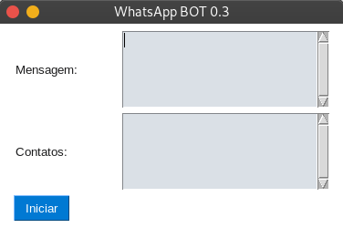

# BOT para WhatsApp Web

O WhatsApp bot é um software de automação de envio de mensagens ilimitadamente sem dependência de servidores ou serviços terceiros. O grande problema de macros que enviam mensagens automaticamente, é terem suas contas do WhatsApp banidas por spam.

O WhatsApp Bot consegue digitar as mensagens como um humano faria, desta forma as chances de ter a conta banida diminuem drasticamente, além disso é possível enviar mensagens diferentes alternadamente, também para diminuir a chance de ter a conta banida, além disso, é possível enviar mensagens para contatos que não tenham te adicionado ainda, como não é possível fazer em listas de transmissão.

## Configuração

Este bot não precisa de APIs terceiras para funcionar, mas necessita que alguns requisitos sejam atendidos:

- Baixar o [ChromeDriver](https://chromedriver.chromium.org/) e coloca-lo no diretório do projeto.
- Instalar as dependências necessárias(vá até o diretório do projeto):

```bash
	pip3 install -r requirements.txt
```

- Ou, **opcionalmente**, instalar as seguintes bibliotecas Python manualmente utilizando o `pip3 install`:

	- PyQt5			4.19.0 [Documentação](https://www.riverbankcomputing.com/static/Docs/PyQt5/) -> `# pip3 install PyQt5`
	- selenium      3.141.0 [Documentação](https://www.selenium.dev/documentation/en/webdriver/keyboard/) -> `# pip3 install selenium`

- No arquivo `messageSender.py`, altere a importação do `chromedriver` para o diretório onde está o executável caso necessário. Por padrão, se encontra na raiz do projeto com o nome `chromedriver`:

```python
	25  self.driver = webdriver.Chrome(
	26      executable_path=r'./chromedriver', # <- Alterar aqui
	27	    options=options
	28  ) # Chrome
```

## Utilizando

Para iniciar, basta utilizar o comando no terminal, dentro do diretório do projeto:

```bash
	python3 __init__.py
```

A seguinte janela será exibida:



Você pode usar o computador para outras atividades e também utilizar o WhatsApp no celular enquanto o BOT está funcionando.

A configuração padrão de intervalos enviará uma média de 30 mensagens por hora, abaixar os intervalos enviará mais mensagens, porém exige que você tenha um bom computador e que não esteja executando tarefas intensivas durante a sua utilização.

## Enviando mensagens

Informe a mensagem que quiser, e no campo contatos informe uma lista de nomes, um nome em cada linha, que **deve estar exatamente como o nome do contato que aparece no chat do WhatsApp e não use emojis em nomes de contatos!!**

**Veja o exemplo de lista de contatos:**

```
	1244448888
	João Paulo
	Grupo Trabalho
	Ricardo Pai
	1155557777
	Ana
```

Clicando em iniciar uma nova janela do chrome será aberta, e você terá 15 segundos para scanear o QR code. Então o BOT manda a mensagem para todos os contatos listados em intervalos diferentes.

## Enviar uma mensagem aleatória

Caso queira enviar aleatóriamente uma mensagem em uma lista de mensagens, separe cada mensagem por `===`, dessa forma as chances de ter o WhatsApp bloqueado diminui.

**Veja o exemplo:**

```
	Mensagem 1
	===
	Mensagem 2
	===
	Mensagem 3
```

## Comando [Enviar Mensagem]

Se desejar dividir as mensagens em mensagens menores use o caractere `§`. Esta prática é recomendável pois desta forma torna as conversas mais naturais, e é possível também variar o tamanho das mensagens de forma flexível para diminuir ainda mais a chance ter a conta banida.

**Veja o exemplo:**

```
	Olá tudo bem?§Meu nome é João, e queria lhe fazer uma oferta para usar nosso produto.§O WhatsApp Bot!!
	===
	Olá, sou o João.§Posso lhe fazer uma proposta?§Use o WhatsApp Bot Hoje mesmo!§Acesse meu site: google.com
```

A mensagem foi dividida em duas mensagens aleatórias e ainda foi subdividida em mensagens menores para enviar uma parte de cada vez.

## Emojis

**Se Você estiver usando emojis, é obrigatório manter o foco na janela do WhatsApp**, nesse caso você não pode estar usando o computador para outras coisas. O `chromedriver` não dá suporte a emojis, portanto, cada emoji deve ser pesquisado pela palavra chave que pode ser encontrada [aqui](https://gist.github.com/hkan/264423ab0ee720efb55e05a0f5f90887), recomendamos que teste para encontrar a melhor palavra chave, para testar escreva no campo de texto do chat do WhatsApp, por exemplo `:receive`, uma lista de emojis devem aparecer, e você deve se certificar que o primeiro que aparece é o `📲`. A sintáxe para inserir o emoji deve ser a seguinte:

```
	_:receive&&__
```

Note que `_` significa que são espaços, um antes do emoji, e dois espaços depois do emoji. Os símbolos `:` e também `&&` são obrigatórios entre a palavra chave do emoji.

**Veja o exemplo:**

```
	Olá, tudo bem?

	Por favor, entre em contato :receive&&  comigo assim que possível.
```

## Registros de atividade

No diretório onde se encontra o WhatsApp Bot, sempre é salvo um registro das mensagens que foram enviadas no arquivo `sent-log.txt`.