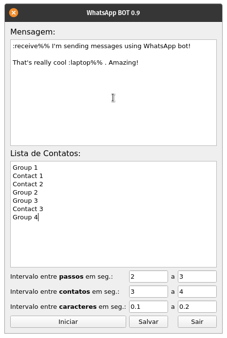

# BOT para WhatsApp Web

## Configuração

Este bot não precisa de APIs terceiras para funcinar, mas precisa de alguns requisitos para funcionar:

- Baixar o [ChromeDriver](https://chromedriver.chromium.org/) e coloca-lo na pasta do projeto.
- Instalar as seguintes bibliotecas Python utilizando o `pip3 install`:

	- PySimpleGUI         4.19.0 [Documentação](https://pysimplegui.readthedocs.io/en/latest/) -> `# pip3 install pysimplegui`
	- selenium            3.141.0 [Documentação](https://www.selenium.dev/documentation/en/webdriver/keyboard/) -> `# pip3 install selenium`

- Você ainda pode precisar instalar a biblioteca `python3-tk` para o funcionamento da interface. Por exemplo:

	- `# sudo apt install python3-tk`
	- `# sudo pacman -S python3-tk`

- No arquivo `main.py` altere a importação do `chromedriver` para o diretótio onde está o executável.

## Utilizando

Para iniciar, basta utilizar o comando no terminal, dentro do diretório do projeto:

> `# python3 main.py`

A seguinte janela será exibida:

Informe a mensagem quem quiser e no campo contatos, informe uma lista de nomes, um nome em cada linha, que deve estar exatamente como o nome do contato que aparece no chat do WhatsApp.

Clicando em iniciar uma nova janela do chrome será aberta, e você terá 30 segundos para scanear o QR code. Então o BOT manda a mensagem para todos os contatos listados em intervalos diferentes.

